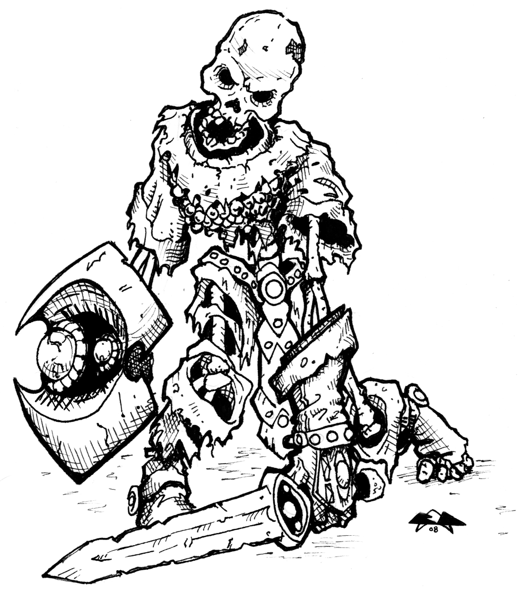

%Der Auftrag
%Laurens Kils-Hütten

#Einleitung
Von anderen Reisenden und Abenteurern hattest Du schon von den
Gerüchten Erfahren. In den Kellergewölben der alten Ruine an der
Landstraße zwischen Seestadt und Steintal, sollte es einen Schatz
geben. So manchen Schatzsucher mochte es in Versuchung geführt
haben. Ob der Schatz schon gefunden wurde, und ob jemals einer der
Mutigen von dem Versuch diesen zu heben zurück zu kehren, darüber gab
es ebenfalls viele Gerüchte und Vermutungen, und nichts davon hörte
sich besonders erheiternd an.

Immerhin, ein junger Abenteurer wie Du kann es sich manchmal nicht
aussuchen, und so sagtest Du zu, als der Graf dir Anbot, dir ein
Zehntel des Schatzes zu überlassen, falls Du ihn finden könntest.

Also sagtest Du ja, und machtest Dich auf den Weg.

#Das Abenteuer

##1 
>Zwei bewaffnete Söldner in Plattenrüstung eskortieren Dich zur Ruine und
>zeigen Dir den Eingang zu den Kellergewölben.

>Als die Soldaten auf die dunkle torbogenartige Öffnung in dem alten Gemäuer
>deuten:

- zögerst Du nicht, und steigst die dunkle Treppe hinunter. ([4])

- überlegst Du es Dir anders und deutest an, dass Du nicht in das
  Gewölbe gehen willst. ([32])

##2
die Fallgrube löst aus.

save gegen "death ray" erfolgreich: ([12])

save gegen death ray scheitert: ([11])

##3
>Du kommst in einen großen Raum von etwa 10 x 10 Metern Grundfläche. In
>der Mitte des Raumes stehen vier Säulen in quadratischer Anordnung.

>In der östlichen Wand siehst Du eine geschlossene doppelflüglige
>Tür. In südlicher Richtung kannst Du eine Öffnung in der Wand
>erkennen, die in einen Gang mündet.

Du gehst:

- Durch die Doppeltür in der Ostwand ([7])

- Durch den Durchgang in der Südwand ([2])

- Dir Treppe hoch zum Ausgang ([35]).

## 4
>Die Treppe führt steil herunter in einen Raum der vielleicht 3 Meter
>unter der Erde liegt. Bei jedem Schritt wird der Moder-Geruch
>deutlicher, der Dir entgegen kommt. Ein unheilmliches Gefühl
>beschleicht Dich.

Weiter bei ([3]).

## 5
Falls Du den Schatz schon gefunden hattest, haben die Söldner ihn Dir
nun leider abgenommen.

>Zum Abschied verpassen Sie Dir noch einen tüchtigen Schlag auf den
>Kopf, und die Welt um Dich herum wird dunkel ...

Weiter bei ([34]).

Falls Du den Schatz aber noch nicht gefunden hast, stossen die Söldner Dich
die Treppe hinunter.

>Während Du halb stolpernd, halb fallend die Treppe hinunter polterst,
>rufen die Söldner Dir noch mit rauhen Stimmen hinter her, dass Du
>gefälligst Deine Aufgabe erledigen sollst.

Weiter bei ([3]).

## 6
>Die Söldner fackeln nicht lange, sondern gehen mit ihren Langschwertern
>auf Dich los. Ein heftiger Kampf entbrennt.

Söldner 1:
AC 17, HD 1, HP 6, Schaden 1d8

Söldner 2:
AC 16, HD 1, HP 4, Schaden 1d8

Falls Du unterliegst werden Die Söldner Dich nicht töten, sondern von
Dir ablassen, sobald deine HP auf 1 oder weniger gesunken sind. In jedem Fall
bist Du damit unterlegen, und es geht für Dich bei ([5]) weiter.

Sollte es Dir tatsächlich gelingen gegen die Söldner zu gewinnen, geht
es weiter bei ([22]).

## 7
Falls Du den Schatz inzwischen gefunden hast geht es weiter bei
([8]). Falls Du noch keinen Schatz gefunden hast, lies weiter bei
([36]).

## 8
Falls Du eine Echsenfigur bei Dir hast, weiter bei ([18]).

Falls Du keine Echsenfigur bei Dir hast, weiter bei ([14]).

## 9
Du befindest Dich in einem scheinbar leeren Raum von etwa 6 x 6 Metern
Grundfläche. An der Südseite führt eine Tür in einen Gang ([10]).

Du kannst den Raum auch genauer Untersuchen ([21]).

## 10
Du befindest Dich in einem etwa 3 Meter breiten Gang, der für etwa 12
Meter in Ost-West-Richtung verläuft.

Am westlichen Ende knickt der
Gang nach Norden ab, und endet mit einer Tür ([9]).

Am östlichen Ende knickt der Gang nach Norden ab und führt an der
Fallgrube vorbei in den Raum mit den vier Säulen ([3]).

## 11
>Plötzlich öffnet sich der Boden unter Dir und Du fällst etwa 4 Meter
>in die Tiefe, und landest hart auf steinigem Boden. Um Dich herum
>liegen einzelne Knochen, die durchaus von früheren Abenteurern
>stammen könnten.

Du ziehst Dir bei dem Sturz 1d4 Schaden zu.

Solltest Du an dieser Stelle HP 0 oder weniger erreicht haben, wird
aus Dir ein Festessen für die Ratten, die hier unten in der Grube leben.

Vielleicht wird eines Tages ein erfahrenerer Abenteurer den Schatz
finden.

Falls Du den Sturz doch überlebst, kannst Du versuchen, an der rauhen
Wand der Grube hoch zu klettern um Dich zu retten.

Würfel dazu mit dem d20. Deinen Bonus auf DEX darfst Du zum
Würfelergebnis dazu zählen. Bei einem Ergebnis von 17 oder mehr, hast
Du es geschafft. Dann geht es weiter bei ([12]).

Bei jedem erfolglosen Versuch verlierst Du einen HP
... die Ratten freuen sich schon.

##12
>Mit weichen Knien bist Du der Grube entkommen.

Du kannst jetzt:

- in den Raum mit den vier Säulen zurück ([3])

- an der Fallgrube vorbei in die andere Richtung ([10])

##13
>Du kommst in einen etwas kleineren Raum mit zwei Säulen. An der
>gegenüberliegenden Wand siehst Du eine Statue, die eine Art
>Echsen-Gottheit darzustellen scheint.
>
>Vor allem aber siehst Du in dem Raum drei Goblins, die nicht weniger
>überrascht zu sein scheinen, als Du es selbst bist.

- Du ziehst Dich zurück ([33])

- Du machst Deine Waffe bereit ([15])

##14
>Du bist in einem etwas kleineren Raum mit zwei Säulen. An der
>gegenüberliegenden Wand siehst Du eine Statue, die eine Art
>Echsen-Gottheit darzustellen scheint.
>
>Als Du Dir den Raum näher ansiehst siehst Du zahlreiche Spuren von
>Goblin-Füßen am Boden. Auf dem Sockel der Echsen-Statue findest Du 5
>gp, 13 sp und einen kleine Beutel mit Heilkräutern.
>
>Nachdem Du dich in dem Raum genug umgesehen hast, gehst Du zurück in
>den Raum mit den vier Säulen ([3]).

##15
>Da die Goblins sich offensichtlich von Dir bedroht fühlen, ziehen Sie
>ihre Schwerter und stellen sich Dir im Kampf.

Goblin 1: 
AC 14, HP 3, Schaden 1d6

Goblin 2:
AC 14, HP 7, Schaden 1d6

Goblin 3:
AC 14, HP 4, Schaden 1d6

Falls deine HP auf 2 oder weniger sinken, lies weiter bei ([16])

Falls du mindestens zwei der Goblins einen Schaden zufügst, lies
weiter bei ([17]).

##16
>Du bist schwer verletzt, aber die Goblins trachten Dir nicht nach dem
>Leben. Viel mehr scheinen Sie Wert darauf zulegen, nun einfach
>schnell hier zu verschwinden. Als Du etwas taumelst stoßen Sie dich
>zu Boden, und nutzen die Gelegenheit, sich schnell aus dem Staub zu
>machen. Erschöpft bleibst Du am Boden liegen. Erst nach einiger Zeit
>kommst Du wieder zu Dir, und beginnst, Dich in diesem Raum um zu sehen. 

Weiter bei ([14]).

##17
>Nach dem Du Dich offensichtlich ernsthaft zur Wehr setzt, überlegen
>die Goblins es sich anders und fliehen in Panik, immerhin schaffen Sie
>es sogar noch, ihren am schwersten verletzten Kammeraden vor Dir in
>Sicherheit zu bringen. Du bleibst etwas verdutzt alleine in diesem
>Raum zurück.

Weiter bei ([14]).

##18
>Du kommst in einen etwas kleineren Raum mit zwei Säulen. An der Wand
>gegenüber der Doppeltür steht einen Statue, die eine Echsen-Gottheit
>darzustellen scheint. Als Du näher tritts, erkennst Du, wie die Statue
>beginnt zu leuchten. Auch die kleine Echsenfigur, die Du bei dem
>Schatz gefunden hast, scheint plötzlich mit einem eigenartigen Schimmer
>zu strahlen.

>Du bleibst stehen, als das Leuchten der Statue immer stärker
>wird. Gleichzeitig ist plötzlich auch ein selbstsames Summen zu
>hören. Mit dem Geräusch einer kleinen Explosion bildet sich im Raum
>genau vor Dir schließlich eine ganze Wand aus bläulich schimmerndem
>Licht - ein Portal, wie es scheint.

- Du machst einen mutigen Schritt und gehst durch das Portal ([19]).

- Dieses Lichtspektakel ist Dir nicht geheuer. Daher gehst Du lieber
wieder zuück in den Raum mit den vier Säulen ([3]).

##19
>Um dich herum ist für einige Momente alles Licht und Farbe. Unmöglich
>zu sagen, wie lange dieser Zustand genau anhält. Schließlich hast Du
>das Gefühl zu stolpern. Mit einem Mal ist das bunte Licht um Dich
>herum verschwunden.

>Du kniest auf morastigem Boden. Um Dich herum ist alles voller
>Pflanzen und Gestrüpp. Dicht vor Dir überquert gerade ein wurmartiges
>Insekt so groß wie Dein Unterarm und mit sehr vielen Beinen die kleine
>Lichtung auf der Du gelandet bist.

>Aus einiger Entfernung hörst Du Rufe, die Dich entfernt an große Vögel
>erinnern, außerdem hörst Du ein sehr tiefes anhaltendes Knurren ...

(die Fortsetzung folgt in einer anderen Dimension, zu einer anderen Zeit)

##20
Du kannst den Raum weiter durchsuchen ([21]), oder zurück in den
Verbindungsgang gehen ([10]).

##21
Um den Raum zu durchsuchen würfel einen d6. Bei 1 oder 2 geht es weiter 
bei ([26]), sonst weiter bei ([20]).

##22
Wenn Du den Schatz gefunden hast, ziehe deines Weges und schreibe Dir 
1000 XP an. Falls Du noch keinen Schatz gefunden hast, oder es Dir noch 
nicht genug ist, gehe wieder die Treppe runter zu ([4]).

##23
Bevor Du begreifen kannst, was überhaupt vor sich geht, spürst Du einen 
letzten heftigen Schlag in der Brust, dann wird alles dunkel.

Künftig wirst Du selbst als Skelett diese Schatzkammer verteidigen.

##24
Würfle eine Probe auf "Save Poison/Death Ray".

wenn du verlierst geht es weiter bei ([23]), wenn du Glück hast geht es
weiter bei ([31]).

##25
Du hast die Sicherung erkannt, und es gelingt Dir den Mechanismus zu 
entschärfen. Du öffnest die Schatztruhe. Weiter bei ([28]).

##26
In der Nordwand entdeckst Du einige Spalten in der Wand, die aussehen, 
als sei hier eine Geheime Tür. 

Du kannst Versuchen die Geheimtür zu öffnen ([30]), 

oder du gehst zurück in den Gang ([10]).

##27
Die Skelette sind klappernd vor Dir zusammen gebrochen. Du kannst jetzt
zurück in den letzten Raum gehen ([9]), oder du kannst versuchen die 
Schatztruhe zu öffnen ([28]).

##28
um die Schatztruhe zu öffnen würfle einen d6. Bei 1 oder zwei weiter bei 
([31]). Sonst weiter bei ([24]).

##29
Kaum betrittst Du den kleinen Raum, greifen dich ohne Umschweife zwei Skelette 
an. Sie wurden hier als Wachen
postiert, und kämpfen bis zum Tode, wenn man das bei Skeletten 
überhaupt so nennen kann. Die Skelette haben folgende Werte:

Skelett 1: 
AC 13, HP 6, Schaden 1d6 

Skelett 2:
AC 13, HP 4, Schaden 1d6

Wenn Du es schaffst die Skelelette zu zerstören geht es weiter bei ([28]).
Wenn Du verlierst geht es weiter bei ([23]).

##30
Ohne große Probleme öffnet sich die Geheimtür. Manchmal kann es wirklich so 
einfach sein. Dahinter eröffnet sich Dir ein Raum, bei dem es sich nur um 
die Schatzkammer handeln kann.

Du gehst mit freudiger Vorahnung in die Schatzkamme ([29]), oder zurück in 
den Gang ([10]).
 
##31
In der Truhe findest Du den ersehnten Schatz. Er besteht aus 31 gp, 56 sp, 
und einer mit Edelsteinen besetzten Goldkette im Wert von 120 gp. Außerdem
liegt in der Truhe eine kleine Echsenfigur aus dunklem Stein.

Nachdem Du das Silber, das Gold und die Kette eingepackt hast, überlegst Du 
ob Du die Echsenfigur auch mitnehmen sollst. Entscheide weise!

Danach gehst Du wieder in den Vorraum der Schatzkammer ([9]).

##32
Die Söldner ziehen ihre Waffen und drängen Dich zurück zum Eingang.

Du gehst die Treppe hinunter ([4]),

Du greifst die Söldner an ([6]).

##33
Zögernd ziehst Du Dich in den Raum mit den vier Säulen zurück. Die Goblins 
schlagen die Doppeltür zu, und du hörst noch kurz ihre Stimmen.

Falls Du nun doch wieder durch die Doppeltür willst geht es weiter bei ([15]).
Sonst weiter bei ([3]).

##34
Verwundet, erschöpft, mittellos und entwaffnet erwachst Du in einer
Waldlichtung. Du weißt nicht mal, wo Du überhaupt bist. Immerhin darfst 
du dir zum Trost 500 XP anschreiben.

##35
Falls Du die Söldner schon besiegt hast geht es weiter bei ([22]). Falls
nicht, gehe zu ([32]).

##36
Falls Du hier noch keinen Goblins begegnet bist geht es weiter bei ([13]),
ansonsten lies weiter bei ([14]).
 
